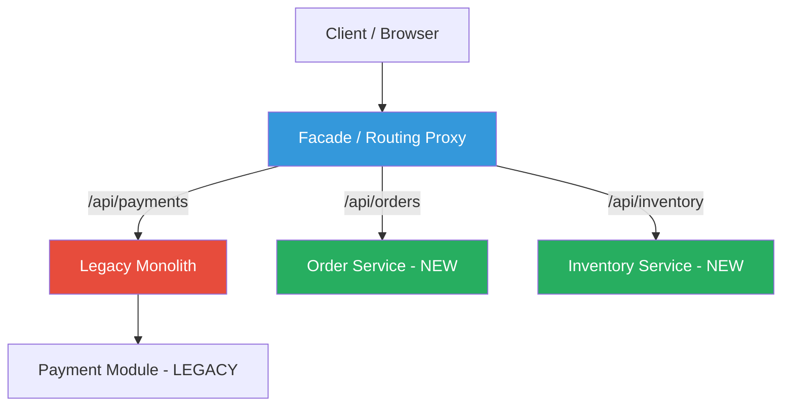
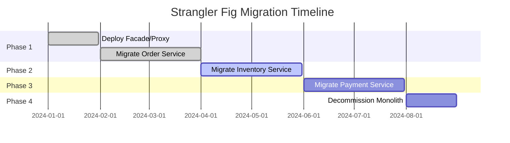

# Strangler Fig Pattern

## 1. Overview — What Is It?

The **Strangler Fig Pattern** is a microservices migration strategy that enables the **gradual replacement** of a monolithic application with microservices. Named after the strangler fig tree that grows around a host tree and eventually replaces it, this pattern allows teams to incrementally extract functionality from a monolith into new services while keeping the system fully operational.

Instead of a risky "big bang" rewrite, a **facade/proxy** sits in front of the monolith and progressively routes traffic to new microservices as they are built and validated.

```
┌─────────────────────────────────────────────────────┐
│                    BEFORE (Monolith)                 │
│  ┌───────────────────────────────────────────────┐   │
│  │  Orders │ Inventory │ Payments │ Shipping     │   │
│  └───────────────────────────────────────────────┘   │
└─────────────────────────────────────────────────────┘

┌─────────────────────────────────────────────────────┐
│                    AFTER (Microservices)             │
│         ┌──────────┐                                │
│         │  Facade   │ (Routes traffic)              │
│         └─────┬─────┘                               │
│    ┌──────────┼──────────┬──────────┐               │
│    ▼          ▼          ▼          ▼               │
│ ┌──────┐ ┌────────┐ ┌────────┐ ┌────────┐         │
│ │Orders│ │Inventory│ │Payments│ │Shipping│         │
│ │(new) │ │ (new)   │ │(legacy)│ │ (new)  │         │
│ └──────┘ └────────┘ └────────┘ └────────┘         │
└─────────────────────────────────────────────────────┘
```

## 2. When to Use

| Scenario | Applicability |
|----------|--------------|
| Migrating a large monolith to microservices | ✅ Ideal |
| Need zero-downtime migration | ✅ Ideal |
| Team can't afford a full rewrite | ✅ Ideal |
| Building a brand-new greenfield system | ❌ Not needed |
| Small monolith with few modules | ⚠️ May be overkill |
| Tight deadline with no room for incremental steps | ❌ Not suitable |

**Key Prerequisites:**

- The monolith has identifiable, separable modules/domains
- A routing layer (reverse proxy, API gateway) can be placed in front of the system
- The team has the infrastructure to run both old and new components simultaneously

## 3. Why to Use — Benefits & Trade-offs

### ✅ Benefits

- **Zero downtime** — The system remains fully functional during migration
- **Reduced risk** — Each microservice is migrated, tested, and validated independently
- **Incremental delivery** — Business value is delivered continuously, not deferred to a "big bang" release
- **Rollback safety** — If a new service fails, traffic can be reverted to the monolith instantly
- **Team autonomy** — Different teams can migrate different modules in parallel

### ⚠️ Trade-offs

- **Increased complexity** — Running two systems (old + new) simultaneously requires more operational overhead
- **Data synchronization** — Shared databases between monolith and new services can be challenging
- **Longer migration timeline** — Incremental migration takes longer than a single rewrite (but is much safer)
- **Facade maintenance** — The routing layer needs to be maintained and updated as services are migrated

## 4. Architecture Design



### Migration Phases



## 5. How to Implement — Step-by-Step

### Step 1: Identify Domain Boundaries

Analyze the monolith and identify bounded contexts (e.g., Orders, Inventory, Payments). Use Domain-Driven Design (DDD) to define clear boundaries.

### Step 2: Set Up the Facade / Proxy

Deploy a reverse proxy (NGINX, API Gateway, or custom router) in front of the monolith. Initially, all traffic passes through to the monolith unchanged.

### Step 3: Build the First Microservice

Extract the first module (pick the one with the fewest dependencies). Build it as a standalone microservice with its own database.

### Step 4: Route Traffic Incrementally

Update the facade to route specific endpoints to the new microservice instead of the monolith. Use feature flags or percentage-based routing for safe rollout.

### Step 5: Validate and Monitor

Monitor error rates, latency, and business metrics. Compare behavior between old and new implementations. Rollback immediately if issues arise.

### Step 6: Repeat for Remaining Modules

Continue extracting modules one by one. Each iteration follows the same build → route → validate cycle.

### Step 7: Decommission the Monolith

Once all traffic has been migrated, shut down the monolith. Remove the facade if no longer needed, or keep it as an API gateway.

## 6. Demo Project

### Scenario: E-Commerce Order Processing Migration

We are migrating a monolithic e-commerce system to microservices. The monolith currently handles:

- **Order Management** — Creating and tracking orders
- **Inventory Management** — Stock levels and availability
- **Payment Processing** — Processing payments

**Migration Strategy:** We extract the **Order Service** first while keeping Inventory and Payment in the monolith. A **Facade Router** directs traffic to the appropriate destination.

### Demo Objectives

1. Show a working monolith that handles all three domains
2. Demonstrate a new standalone Order microservice
3. Implement a Facade that routes `/orders` to the new service and everything else to the monolith
4. Show how rollback works by toggling a feature flag

### How to Run

#### Java Demo

```bash
cd demo/java
# Compile and run
javac -d out src/*.java
java -cp out StranglerFigDemo
```

#### Python Demo

```bash
cd demo/python
pip install flask requests
# Terminal 1: Start the monolith
python monolith.py
# Terminal 2: Start the new order service
python order_service.py
# Terminal 3: Start the facade router
python facade_router.py
# Terminal 4: Test
python test_client.py
```

### Key Takeaways from the Demo

- The **facade** transparently routes requests — clients don't know which backend serves them
- The **monolith** and **microservice** run simultaneously without conflicts
- **Rollback** is instant — just change the routing rule in the facade
- The pattern enables **zero-downtime migration** with minimal risk


## 7. Key Takeaway
> **Migrate gradually, not suddenly.** The Strangler Fig pattern minimizes risk by allowing a legacy monolith to be replaced service-by-service without downtime.

## 8. Knowledge Quiz

<details>
<summary><strong>Question 1: What is the primary purpose of the Strangler Fig pattern?</strong></summary>
To run legacy and new systems in parallel and gradually route traffic from the old monolith to the new microservices until the monolith is retired.
</details>

<details>
<summary><strong>Question 2: What component makes the routing decisions in this pattern?</strong></summary>
A routing facade or reverse proxy (e.g., NGINX, API Gateway) placed at the edge of the system.
</details>

<details>
<summary><strong>Question 3: When should you NOT use the Strangler Fig pattern?</strong></summary>
When the system is small, easy to rewrite entirely in one go, or when the cost of maintaining the legacy and new systems concurrently outweighs the migration benefits.
</details>
