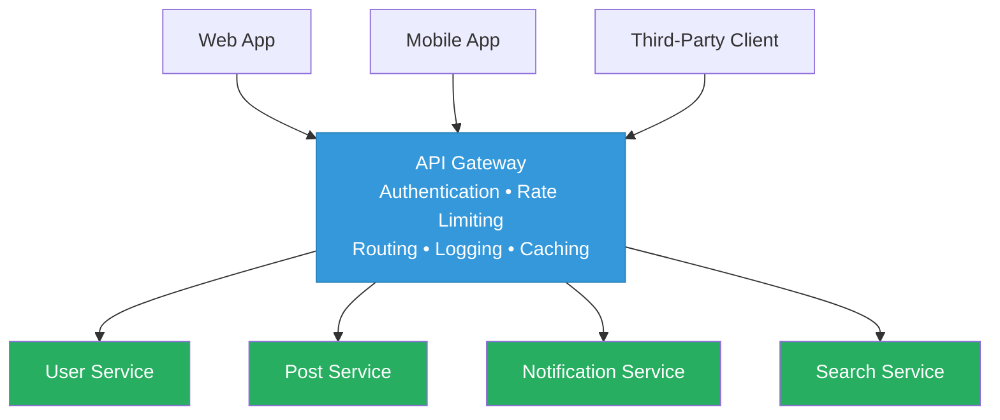
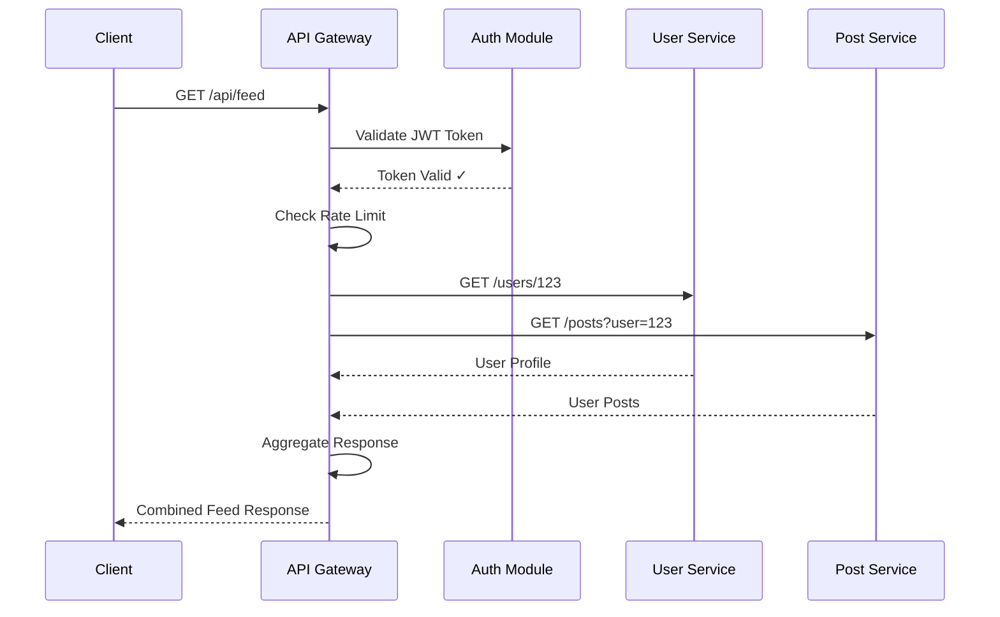

# API Gateway Pattern

## 1. Overview — What Is It?

The **API Gateway Pattern** centralizes external access to your microservices by providing a **single entry point** for all client requests. Instead of clients calling multiple services directly, they communicate only with the gateway, which handles routing, composition, and cross-cutting concerns.

Think of it as a **smart receptionist** at a large hospital — patients don't wander around looking for departments; they check in at the front desk, which directs them to the right place.

```
┌──────────────────────────────────────────────────────────┐
│                WITHOUT API Gateway                       │
│                                                          │
│  Client ──→ User Service (port 8001)                     │
│  Client ──→ Post Service (port 8002)                     │
│  Client ──→ Notification Service (port 8003)             │
│  Client ──→ Search Service (port 8004)                   │
│  ❌ Client must know all service URLs and ports          │
└──────────────────────────────────────────────────────────┘

┌──────────────────────────────────────────────────────────┐
│                  WITH API Gateway                        │
│                                                          │
│  Client ──→ API Gateway (port 8000) ──→ User Service     │
│                                    ──→ Post Service      │
│                                    ──→ Notification Svc  │
│                                    ──→ Search Service    │
│  ✅ Client only knows one URL                           │
└──────────────────────────────────────────────────────────┘
```

## 2. When to Use

| Scenario | Applicability |
|----------|--------------|
| Multiple microservices need a unified API | ✅ Ideal |
| Need centralized auth, rate limiting, logging | ✅ Ideal |
| Mobile/web clients need aggregated responses | ✅ Ideal |
| Simple monolithic application | ❌ Overkill |
| Services only communicate internally (no external clients) | ❌ Not needed |
| Single microservice behind a load balancer | ⚠️ May be overkill |

**Key Prerequisites:**

- You have multiple backend microservices
- External clients (web, mobile, third-party) need to access these services
- You want to centralize cross-cutting concerns (auth, logging, rate limiting)

## 3. Why to Use — Benefits & Trade-offs

### ✅ Benefits

- **Simplified client** — Clients call one URL instead of many
- **Centralized security** — Authentication and authorization happen at the gateway
- **Rate limiting** — Protect backend services from abuse
- **Request aggregation** — Combine data from multiple services into one response
- **Protocol translation** — Translate between REST, gRPC, WebSocket, etc.
- **Monitoring** — Single point for logging, metrics, and tracing
- **API versioning** — Manage multiple API versions without changing backends

### ⚠️ Trade-offs

- **Single point of failure** — If the gateway goes down, all services are inaccessible (mitigate with redundancy)
- **Added latency** — Extra network hop for every request
- **Complexity** — The gateway itself can become a complex, hard-to-maintain service
- **Bottleneck risk** — All traffic flows through one component (mitigate with horizontal scaling)

## 4. Architecture Design



### Request Flow



## 5. How to Implement — Step-by-Step

### Step 1: Define Your API Surface

Map out all the endpoints your clients need. Group them by domain (users, posts, notifications).

### Step 2: Choose a Gateway Technology

- **Custom built** — Spring Cloud Gateway, Express.js, FastAPI
- **Managed** — AWS API Gateway, Azure API Management, Kong, Envoy

### Step 3: Implement Routing Rules

Configure the gateway to route incoming requests to the correct backend service based on URL path, headers, or query parameters.

### Step 4: Add Cross-Cutting Concerns

- **Authentication** — Validate tokens before forwarding requests
- **Rate Limiting** — Limit requests per client/IP
- **Logging** — Log all incoming requests for monitoring
- **Caching** — Cache frequently accessed responses

### Step 5: Implement Request Aggregation (Optional)

For endpoints that need data from multiple services, create aggregation endpoints that call multiple backends and combine the results.

### Step 6: Deploy with High Availability

Deploy multiple gateway instances behind a load balancer to avoid single-point-of-failure.

## 6. Demo Project

### Scenario: Social Network Platform

A social network with three backend microservices:

- **User Service** — Profiles, friends, settings
- **Post Service** — Creating, listing, liking posts
- **Notification Service** — Real-time notifications

The **API Gateway** provides:

- Unified entry point on port 8000
- JWT-based authentication
- Rate limiting (max requests per minute)
- Request aggregation (user feed = user profile + posts)
- Request logging

### Demo Objectives

1. Show how the gateway routes requests to different backend services
2. Demonstrate centralized authentication at the gateway level
3. Show rate limiting in action
4. Demonstrate request aggregation (combining data from multiple services)
5. Show centralized request logging

### How to Run

#### Java Demo

```bash
cd demo/java
javac -d out src/*.java
java -cp out ApiGatewayDemo
```

#### Python Demo

```bash
cd demo/python
pip install flask requests
# Terminal 1: Start User Service
python user_service.py
# Terminal 2: Start Post Service
python post_service.py
# Terminal 3: Start Notification Service
python notification_service.py
# Terminal 4: Start API Gateway
python api_gateway.py
# Terminal 5: Run tests
python test_client.py
```

### Key Takeaways from the Demo

- Clients interact with **one URL** (the gateway) instead of multiple service URLs
- **Authentication** is handled once at the gateway, not in every service
- **Rate limiting** protects all services uniformly
- The **feed endpoint** demonstrates aggregation (combining user + posts data)
- **Request logging** at the gateway provides visibility into all traffic


## 7. Key Takeaway
> **Centralize external concerns.** An API Gateway acts as the single entry point for clients, handling cross-cutting concerns (authentication, routing, rate limiting) so microservices can focus solely on business logic.

## 8. Knowledge Quiz

<details>
<summary><strong>Question 1: Why use an API Gateway instead of direct client-to-microservice communication?</strong></summary>
Direct communication creates tight coupling, forces the client to handle multiple addresses/protocols, and makes cross-cutting concerns (auth, logging) redundant across services.
</details>

<details>
<summary><strong>Question 2: What is "Gateway Aggregation"?</strong></summary>
The capability of an API Gateway to receive a single client request, trigger multiple internal backend microservices, aggregate their responses, and send a unified payload back to the client.
</details>

<details>
<summary><strong>Question 3: What is the main risk of the API Gateway pattern?</strong></summary>
It introduces a Single Point of Failure and a potential performance bottleneck if not scaled correctly.
</details>
