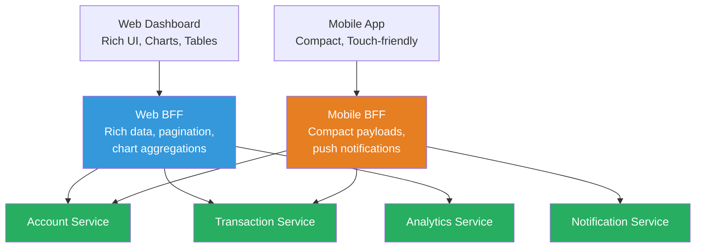
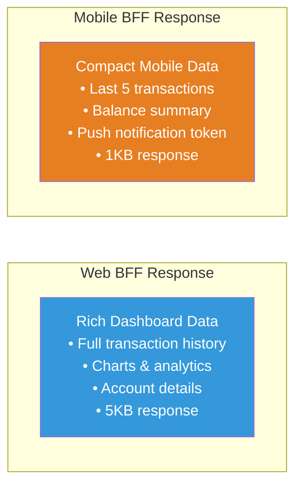

# Backends for Frontends (BFF) Pattern

## 1. Overview — What Is It?

The **Backends for Frontends (BFF) Pattern** creates **dedicated backend services for each frontend** type (web, mobile, IoT, etc.). Instead of one generic API serving all clients, each frontend gets a tailored backend that optimizes the API responses for its specific needs.

A mobile app needs compact, battery-efficient responses. A web dashboard needs rich, data-heavy responses. A smartwatch needs minimal data. The BFF pattern gives each client exactly what it needs.

```
┌──────────────────────────────────────────────────────────┐
│              WITHOUT BFF (One-size-fits-all)             │
│                                                          │
│  Web App     ──→  Generic API  ──→  Services             │
│  Mobile App  ──→  Generic API  ──→  Services             │
│  ❌ Mobile gets unnecessary data, slow and heavy         │
│  ❌ Web gets insufficient data, needs multiple calls     │
└──────────────────────────────────────────────────────────┘

┌──────────────────────────────────────────────────────────┐
│                  WITH BFF (Tailored APIs)                 │
│                                                          │
│  Web App     ──→  Web BFF     ──→  Services              │
│  Mobile App  ──→  Mobile BFF  ──→  Services              │
│  ✅ Each client gets optimized responses                 │
└──────────────────────────────────────────────────────────┘
```

## 2. When to Use

| Scenario | Applicability |
|----------|--------------|
| Web and mobile apps with different UI/UX needs | ✅ Ideal |
| Multiple frontend platforms (web, iOS, Android, IoT) | ✅ Ideal |
| Frontends need different data shapes or aggregations | ✅ Ideal |
| Single frontend type (web-only or mobile-only) | ❌ Overkill |
| All frontends need identical API responses | ❌ Not needed |
| Simple CRUD application | ⚠️ Probably overkill |

**Key Prerequisites:**

- Multiple frontend types with **different** data/performance needs
- Backend services that can be called by multiple BFF instances
- Dedicated frontend teams that can own their BFF

## 3. Why to Use — Benefits & Trade-offs

### ✅ Benefits

- **Optimized responses** — Each frontend gets exactly the data it needs (no over-fetching or under-fetching)
- **Independent evolution** — Frontend teams can evolve their BFF without affecting other platforms
- **Performance** — Mobile BFF can return smaller payloads; Web BFF can return richer data
- **Reduced coupling** — Frontend changes don't require changes to a shared API layer
- **Platform-specific features** — Push notifications for mobile, WebSocket for web, etc.
- **Team autonomy** — Each frontend team owns their BFF

### ⚠️ Trade-offs

- **Code duplication** — Some logic may be duplicated across BFFs
- **More services to maintain** — Each BFF is an additional deployable service
- **Coordination needed** — Changes to core services affect all BFFs
- **Consistency risk** — Different BFFs might implement the same business logic differently

## 4. Architecture Design



### Response Comparison



## 5. How to Implement — Step-by-Step

### Step 1: Identify Frontend Differences

Document what each frontend needs: data shape, payload size, update frequency, platform-specific features.

### Step 2: Design Core Shared Services

Build reusable backend services (Account, Transaction, etc.) with generic APIs that any BFF can consume.

### Step 3: Build the Web BFF

Create a backend optimized for the web dashboard: rich responses, pagination support, chart data aggregation.

### Step 4: Build the Mobile BFF

Create a backend optimized for mobile: compact payloads, push notification registration, offline-first support.

### Step 5: Frontend Teams Own Their BFFs

Let each frontend team manage their BFF. They know best what data shape their UI needs.

### Step 6: Avoid Duplication with Shared Libraries

Extract common business logic into shared libraries that all BFFs can use, reducing code duplication.

## 6. Demo Project

### Scenario: Banking Application

A banking app with two front-end platforms:

- **Web Dashboard** — Rich financial dashboard with charts, full transaction history, analytics
- **Mobile App** — Compact banking app with balance overview, recent transactions, quick transfers

**Core Services:**

- Account Service — Manages accounts and balances
- Transaction Service — Handles transactions and history

**The two BFFs demonstrate:**

- Web BFF returns rich, detailed responses with analytics data
- Mobile BFF returns compact, summarized responses optimized for small screens

### Demo Objectives

1. Show how the **same core services** serve different frontends
2. Compare **response sizes** between Web BFF and Mobile BFF
3. Demonstrate **platform-specific optimizations** (charts for web, compact for mobile)
4. Show how BFFs can be independently evolved

### How to Run

#### Java Demo

```bash
cd demo/java
javac -d out src/*.java
java -cp out BffPatternDemo
```

#### Python Demo

```bash
cd demo/python
pip install flask requests
# Terminal 1: Start core services (Account + Transaction)
python core_services.py
# Terminal 2: Start Web BFF
python web_bff.py
# Terminal 3: Start Mobile BFF
python mobile_bff.py
# Terminal 4: Run comparison tests
python test_client.py
```

### Key Takeaways from the Demo

- The **Web BFF** returns detailed data (~5x larger payloads) optimized for dashboards
- The **Mobile BFF** returns compact data optimized for small screens and slow networks
- Both BFFs call the **same core services** but shape the data differently
- Each BFF can evolve independently without affecting the other platform
