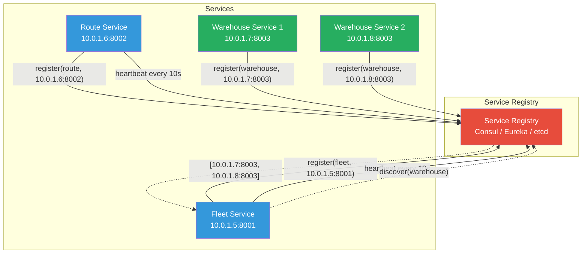
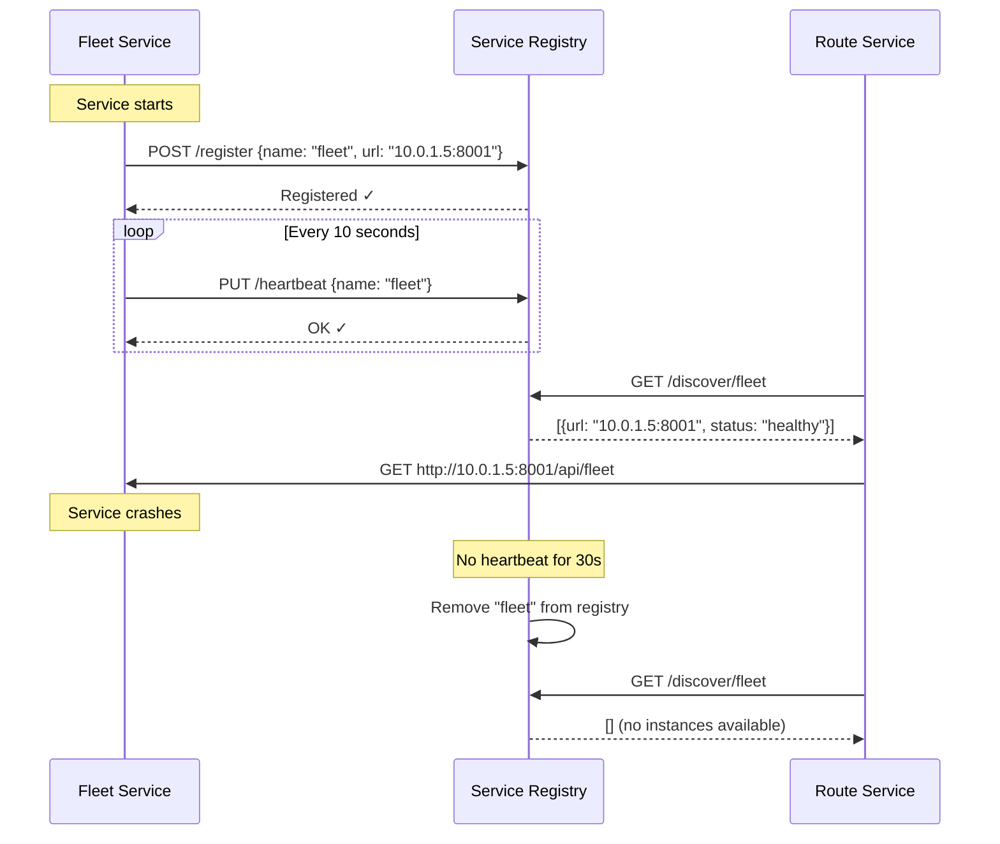

# Service Discovery Pattern

## 1. Overview — What Is It?

The **Service Discovery Pattern** enables microservices to **dynamically find and communicate with each other** without hardcoded URLs or manual configuration. As services scale up, move between servers, or restart, their network addresses change. Service Discovery maintains a live registry of available services and their locations.

Think of it like a **phone directory** that automatically updates when people get new numbers — instead of memorizing every number, you just look it up.

```
┌──────────────────────────────────────────────────────────┐
│              WITHOUT Service Discovery                   │
│                                                          │
│  Order Service ---config: "payment:192.168.1.10:8080"    │
│  ❌ IP changed? Service breaks.                         │
│  ❌ New instance? Manual config update.                  │
│  ❌ Instance died? No one knows.                        │
└──────────────────────────────────────────────────────────┘

┌──────────────────────────────────────────────────────────┐
│                WITH Service Discovery                    │
│                                                          │
│  Order Service --lookup("payment")-→ Registry            │
│  Registry returns: ["10.0.1.5:8080", "10.0.1.6:8080"]   │
│  ✅ Auto-updated when services move/scale/restart       │
└──────────────────────────────────────────────────────────┘
```

### Two Models

| Model | How It Works | Example |
|-------|-------------|---------|
| **Client-side discovery** | Client queries registry, then calls service directly | Netflix Eureka, Consul |
| **Server-side discovery** | Client calls a router/LB, which queries registry | AWS ELB, Kubernetes Services |

## 2. When to Use

| Scenario | Applicability |
|----------|--------------|
| Microservices with dynamic scaling (auto-scaling) | ✅ Ideal |
| Cloud-native applications with containerized services | ✅ Ideal |
| Services that frequently start/stop/move | ✅ Ideal |
| Monolithic application on a single server | ❌ Not needed |
| Fixed number of services with static IPs | ⚠️ Overkill |
| Development/testing with known endpoints | ⚠️ Optional |

**Key Prerequisites:**

- Dynamic infrastructure (containers, VMs, cloud)
- Multiple services that need to communicate
- Services that can change IP/port at any time

## 3. Why to Use — Benefits & Trade-offs

### ✅ Benefits

- **Dynamic scaling** — New instances are automatically discoverable
- **Fault tolerance** — Dead instances are removed from the registry
- **No hardcoded URLs** — Services find each other by name, not IP address
- **Load balancing** — Discovery can return multiple instances for client-side load balancing
- **Health monitoring** — Registry tracks service health via heartbeats
- **Environment agnostic** — Same code works in dev, staging, and production

### ⚠️ Trade-offs

- **Additional infrastructure** — Requires running a registry service
- **Complexity** — Adds another moving part to the system
- **Consistency** — Registry might have slightly stale data
- **Network dependency** — If registry is down, services can't discover each other (mitigate with caching)

## 4. Architecture Design



### Service Lifecycle



## 5. How to Implement — Step-by-Step

### Step 1: Deploy a Service Registry

Choose a registry technology (Consul, Eureka, etcd, ZooKeeper) or build a lightweight one for learning.

### Step 2: Implement Self-Registration

Each service, on startup, registers itself with the registry (name, host, port, health endpoint).

### Step 3: Implement Heartbeat / Health Check

Services send periodic heartbeats to the registry. If heartbeats stop, the registry marks the service as unhealthy and eventually removes it.

### Step 4: Implement Service Discovery

When a service needs to call another, it queries the registry by name and gets back a list of healthy instances.

### Step 5: Implement Client-Side Load Balancing

If the registry returns multiple instances, the calling service picks one (round-robin, random, least-connections).

### Step 6: Handle Registry Failure

Cache discovered endpoints locally so services can still communicate if the registry is temporarily unavailable.

## 6. Demo Project

### Scenario: Logistics System

A logistics platform with dynamically scaling services:

- **Fleet Service** — Manages delivery vehicles and drivers
- **Route Service** — Calculates optimal delivery routes  
- **Warehouse Service** — Manages warehouse inventory (multiple instances for high availability)
- **Service Registry** — Central registry where all services register and discover each other

### Demo Objectives

1. Show services **self-registering** with the registry on startup
2. Demonstrate **heartbeat** mechanism to detect failures
3. Show how services **discover** each other by name
4. Demonstrate **multiple instances** of Warehouse Service with load balancing
5. Show **automatic deregistration** when a service stops sending heartbeats

### How to Run

#### Java Demo

```bash
cd demo/java
javac -d out src/*.java
java -cp out ServiceDiscoveryDemo
```

#### Python Demo

```bash
cd demo/python
pip install flask requests
# Terminal 1: Start Service Registry
python service_registry.py
# Terminal 2: Start Fleet Service
python fleet_service.py
# Terminal 3: Start Warehouse Service (instance 1)
python warehouse_service.py 8003
# Terminal 4: Start Warehouse Service (instance 2)
python warehouse_service.py 8004
# Terminal 5: Run demo client
python test_client.py
```

### Key Takeaways from the Demo

- Services **automatically register** on startup — no manual configuration
- The registry **detects failures** via missed heartbeats
- **Multiple instances** of the same service are discoverable
- Clients use **service names** (not URLs) to find services, enabling location-transparent communication


## 7. Key Takeaway
> **Services should find each other automatically.** Service Discovery eliminates hardcoded static IP configurations, allowing microservices to register dynamically and be discovered at runtime, which is crucial for auto-scaling and ephemeral environments.

## 8. Knowledge Quiz

<details>
<summary><strong>Question 1: What is the difference between Client-Side and Server-Side discovery?</strong></summary>
In Client-Side, the client queries the registry and load balances the request itself. In Server-Side, a proxy queries the registry and routes the traffic on behalf of the client.
</details>

<details>
<summary><strong>Question 2: What is the "Registry" in this pattern?</strong></summary>
A highly available database containing the network locations (IPs and Ports) of available service instances (e.g., Consul, Eureka).
</details>

<details>
<summary><strong>Question 3: How does the Service Registry know when a node has died?</strong></summary>
Through health checks or missing heartbeats. If an instance stops sending periodic heartbeats, the registry removes it from the list of available services.
</details>
