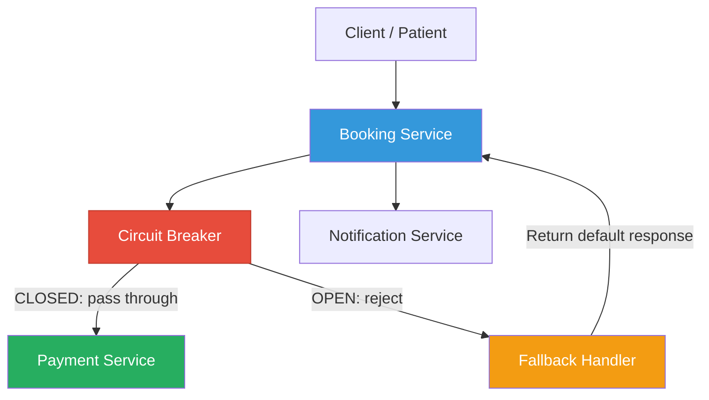
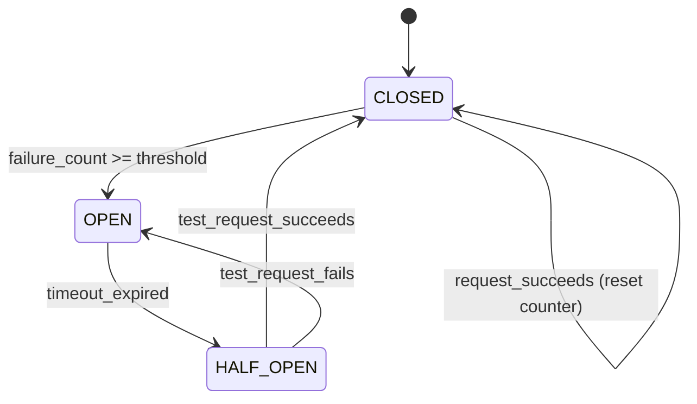

# Circuit Breaker Pattern

## 1. Overview — What Is It?

The **Circuit Breaker Pattern** is a fault-tolerance mechanism that **prevents cascading failures** in microservices by detecting when a downstream service is failing and automatically stopping requests to it. Like an electrical circuit breaker that trips to prevent a fire, this pattern "trips" to prevent your entire system from going down when one service fails.

```
┌──────────────────────────────────────────────────────────┐
│              WITHOUT Circuit Breaker                     │
│                                                          │
│  Booking Service ──→ Payment Service (DOWN)              │
│    → Hangs for 30s timeout                               │
│    → All threads blocked                                 │
│    → Booking Service also goes down                      │
│    → ❌ CASCADING FAILURE across the entire system       │
└──────────────────────────────────────────────────────────┘

┌──────────────────────────────────────────────────────────┐
│                WITH Circuit Breaker                      │
│                                                          │
│  Booking ──→ [Circuit Breaker] ──→ Payment (DOWN)       │
│    → Detects 5 failures in a row                         │
│    → OPENS the circuit (trips the breaker)               │
│    → Returns fallback response instantly                 │
│    → ✅ Booking Service stays healthy                    │
└──────────────────────────────────────────────────────────┘
```

### Three States

```
  ┌────────┐    failures >= threshold    ┌────────┐
  │ CLOSED │ ──────────────────────────→ │  OPEN  │
  │(normal)│                             │(reject)│
  └────────┘                             └───┬────┘
       ▲                                     │
       │    success                   timeout │
       │                                     ▼
       │                              ┌──────────┐
       └──────────────────────────────│HALF-OPEN  │
                                      │(test one) │
                                      └──────────┘
```

| State | Behavior |
|-------|----------|
| **CLOSED** | Normal operation. Requests pass through. Failures are counted. |
| **OPEN** | Circuit is tripped. All requests are immediately rejected with a fallback response. |
| **HALF-OPEN** | After a timeout, one test request is allowed through. If it succeeds → CLOSED. If it fails → OPEN again. |

## 2. When to Use

| Scenario | Applicability |
|----------|--------------|
| Calling external services that may fail | ✅ Ideal |
| Preventing cascading failures across microservices | ✅ Ideal |
| Protecting against slow/unresponsive dependencies | ✅ Ideal |
| Internal method calls within a single service | ❌ Not needed |
| Database connections (use connection pooling instead) | ⚠️ Depends |
| Static file serving | ❌ Not applicable |

**Key Prerequisites:**

- Your service depends on external/downstream services
- Those dependencies can fail, slow down, or become unavailable
- You need your service to remain operational even when dependencies fail

## 3. Why to Use — Benefits & Trade-offs

### ✅ Benefits

- **Prevents cascading failures** — One service failure doesn't take down the entire system
- **Fast failure** — Instead of waiting for a timeout, requests fail immediately when circuit is open
- **Self-healing** — Automatically recovers when the downstream service comes back
- **Resource protection** — Prevents thread pool exhaustion from hanging requests
- **Graceful degradation** — Fallback responses keep the user experience acceptable

### ⚠️ Trade-offs

- **False positives** — Circuit might open due to temporary network blips
- **Tuning required** — Failure threshold, timeout, and half-open retry count need careful tuning
- **Monitoring needed** — You need alerts when circuits open
- **Data consistency** — Fallback responses may return stale or incomplete data

## 4. Architecture Design



### State Machine



## 5. How to Implement — Step-by-Step

### Step 1: Define the Circuit Breaker

Create a circuit breaker class with three states (CLOSED, OPEN, HALF_OPEN), a failure counter, and configurable thresholds.

### Step 2: Wrap External Calls

Wrap every call to the downstream service through the circuit breaker. The breaker decides whether to allow the call or return a fallback.

### Step 3: Track Failures

In the CLOSED state, count consecutive failures. When the count reaches the threshold, transition to OPEN.

### Step 4: Implement the OPEN State

In the OPEN state, immediately return a fallback response without calling the downstream service. Start a timer for the recovery timeout.

### Step 5: Implement the HALF-OPEN State

After the timeout, allow ONE test request through. If it succeeds, reset the counter and return to CLOSED. If it fails, go back to OPEN.

### Step 6: Add Fallback Logic

Define sensible fallback responses: cached data, default values, queued operations, or graceful error messages.

### Step 7: Add Monitoring

Log state transitions, alert on circuit opens, and track metrics (failure rates, recovery times).

## 6. Demo Project

### Scenario: Medical Appointment System

A medical appointment platform where:

- **Booking Service** — Handles appointment scheduling
- **Payment Service** — Processes payments (UNRELIABLE — may go down)
- **Circuit Breaker** — Protects Booking Service from Payment Service failures

The demo simulates:

1. Normal operation (circuit CLOSED)
2. Payment service failures causing the circuit to OPEN
3. Fallback responses when circuit is OPEN
4. Payment service recovery (circuit transitions to HALF-OPEN → CLOSED)

### Demo Objectives

1. Show the **three states** (CLOSED → OPEN → HALF-OPEN → CLOSED) in action
2. Demonstrate **fallback responses** when the circuit is open
3. Show **automatic recovery** when the downstream service recovers
4. Visualize **failure counting** and **threshold-based tripping**

### How to Run

#### Java Demo

```bash
cd demo/java
javac -d out src/*.java
java -cp out CircuitBreakerDemo
```

#### Python Demo

```bash
cd demo/python
pip install flask requests
# Terminal 1: Start Payment Service (with simulated failures)
python payment_service.py
# Terminal 2: Start Booking Service (with circuit breaker)
python booking_service.py
# Terminal 3: Run the demo
python test_client.py
```

### Key Takeaways from the Demo

- The circuit breaker **prevents cascading failures** — Booking Service stays healthy even when Payment crashes
- **Fallback responses** ensure users get polite error messages, not HTTP 500s
- The circuit **self-heals** — it automatically retests the Payment Service and recovers
- **State transitions** are clearly logged for monitoring and debugging


## 7. Key Takeaway
> **Fail fast and prevent cascades.** A Circuit Breaker protects a struggling service from being overloaded and isolates failures so that one faulty microservice doesn't take down the entire system.

## 8. Knowledge Quiz

<details>
<summary><strong>Question 1: What does it mean when the circuit is "OPEN"?</strong></summary>
The downstream service is deemed unhealthy, so requests are immediately rejected (or fallback responses are returned) without attempting to hit the downstream service.
</details>

<details>
<summary><strong>Question 2: How does the circuit transition back to "CLOSED"?</strong></summary>
After a timeout in the OPEN state, it goes to "HALF-OPEN" and allows a limited number of test requests. If they succeed, the circuit closes (normal operation resumes). If they fail, it trips back to OPEN.
</details>

<details>
<summary><strong>Question 3: What is a "Fallback Response"?</strong></summary>
A graceful degradation strategy where the caller receives cached data, default values, or a polite error instead of a complete failure or timeout when the circuit is tripped.
</details>
