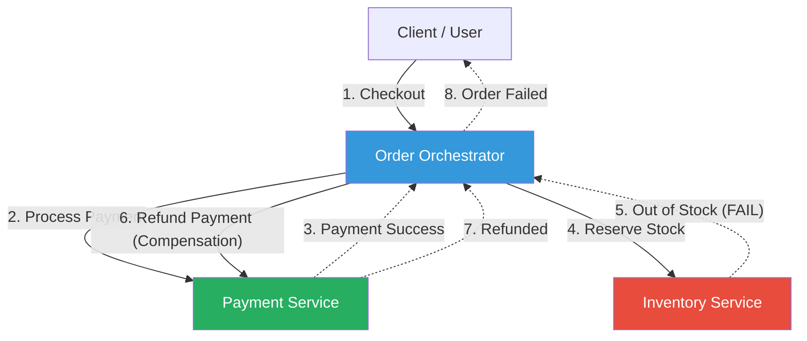

# Saga Pattern

## 1. Overview — What Is It?

The **Saga Pattern** is a failure management pattern that helps establish consistency in distributed applications, and coordinates transactions between multiple microservices. In a microservices architecture, a single business process often spans multiple services, each with its own local database. Because traditional distributed ACID transactions (like the Two-Phase Commit protocol) are slow, blocking, and scale poorly, the Saga pattern offers a fundamentally different approach.

Instead of one giant transaction, a Saga breaks the process into a **sequence of local transactions**. 
* Each local transaction updates the database and publishes a message or event to trigger the next local transaction in the saga.
* If a local transaction fails because it violates a business rule, the saga executes a series of **compensating transactions** that undo the changes made by the preceding local transactions.

### How It Works

```
┌──────────────────────────────────────────────────────────┐
│              WITHOUT Saga (2-Phase Commit)               │
│                                                          │
│  Orchestrator ──→ Lock Order DB                          │
│    Lock Payment DB ──→ Lock Inventory DB                 │
│      Wait for all to acknowledge... (SYSTEM BLOCKED)     │
│        Commit all!                                       │
│                                                          │
│  ❌ Terrible for performance and availability.           │
└──────────────────────────────────────────────────────────┘

┌──────────────────────────────────────────────────────────┐
│                  WITH Saga Pattern                       │
│                                                          │
│  Order Service ──→ Creates Order (Status: PENDING)       │
│    Payment Service ──→ Charges Card (Success)            │
│      Inventory Service ──→ Fails to reserve stock!       │
│                                                          │
│  [COMPENSATION TRIGGERED]                                │
│    Payment Service ──→ Refunds Card                      │
│      Order Service ──→ Cancels Order                     │
│                                                          │
│  ✅ Eventual Consistency achieved without long locks.    │
└──────────────────────────────────────────────────────────┘
```

## 2. Approaches: Orchestration vs Choreography

There are two primary ways to coordinate a saga: **Choreography** and **Orchestration**.

### 1. Choreography (Decentralized)
Each local transaction publishes domain events that trigger local transactions in other services. There is no central point of control.

* **Pros:** Good for simple workflows with few participants. Loose coupling. No single point of failure.
* **Cons:** Hard to understand the flow for complex processes. Risk of cyclic dependencies. Difficult to test the entire flow end-to-end.

### 2. Orchestration (Centralized)
An orchestrator (often the service that initiated the saga) tells the participants what local transactions to execute. The orchestrator tracks the state of the saga and handles failure scenarios.

* **Pros:** Perfect for complex workflows. Avoids cyclical dependencies. Clear separation of concerns (participants only care about their local tasks).
* **Cons:** The orchestrator can become a design bottleneck (too much business logic). Introduces a single point of failure (though this can be mitigated with clustered state machines).

## 3. When to Use

| Scenario | Applicability |
|----------|--------------|
| Transactions spanning multiple microservices | ✅ Ideal |
| Long-running business processes | ✅ Ideal |
| Systems requiring high availability and low latency | ✅ Ideal |
| Updating data in a single database | ❌ Not needed |
| Real-time ACID consistency required at all times | ❌ Not applicable |

## 4. Architecture Design

### Orchestration Workflow (E-commerce Example)



## 5. How to Implement — Step-by-Step (Orchestration)

### Step 1: Define the Workflow
Identify all the microservices involved in the transaction and the happy path sequence.

### Step 2: Define Compensating Actions
For every action that mutates state, define a clear compensating action (e.g., `ChargeCard` -> `RefundCard`). **Crucially, compensating actions must be idempotent** (they can be called multiple times without adverse effects in network retries).

### Step 3: Implement an Orchestrator (State Machine)
Create a centralized orchestrator service. The orchestrator maintains the state of the saga and issues commands to downstream services.

### Step 4: Handle Asynchronous Communication
Use a message broker (like Kafka, RabbitMQ) or resilient HTTP calls (paired with the Circuit Breaker pattern) to issue commands from the orchestrator and receive replies.

### Step 5: Implement Retries and Logging
Log every state transition in the saga so it can be resumed if a service crashes. Ensure that downstream services can handle duplicate requests gracefully (Idempotency keys).

## 6. Demo Project

### Scenario: E-Commerce Order Processing

We will simulate an **Orchestrated Saga**:
- **Order Service (Orchestrator)**
- **Payment Service**
- **Inventory Service**

We will demonstrate:
1. **Happy Path**: Order is created -> Payment successful -> Inventory reserved -> Order Approved.
2. **Failure Path**: Order is created -> Payment successful -> Inventory runs out -> **Payment Refunded (Compensation)** -> Order Cancelled.

### How to Run

#### Python Demo
The Python demo uses simple local scripts simulating the microservices communicating synchronously for demonstration simplicity.

```bash
cd demo/python
python test_saga.py
```

#### Java Demo
The Java demo implements a central orchestrator class coordinating mock service instances.

```bash
cd demo/java
javac -d out src/*.java
java -cp out SagaDemo
```

### Key Takeaways from the Demo

- The Orchestrator clearly defines the sequence of operations.
- Failures in the downstream (`InventoryService`) do not leave the system in an inconsistent state, as the Orchestrator safely unwinds the transaction.
- The compensating transaction (`refund_payment`) effectively functions as a distributed rollback.
